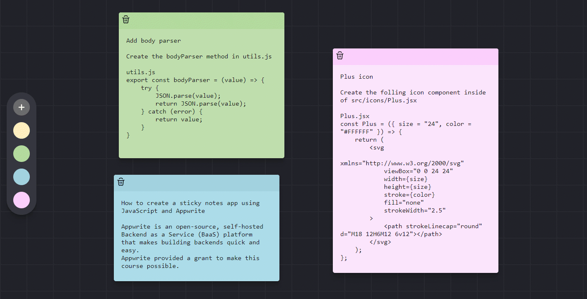

## Appwrite & Draggable Notes

### Drag & Drop sticky notes App built with  Appwrite & React

[site](https://appwrite-draggable-notes-sxidsvit.vercel.app/)




### Tech Stack

-  React & Vite
-  [AppWrite](https://appwrite.io/)

### Features

-   Drag and Drop notes anywhere on screen
-   Save note data, position and color in database
-   Change note color at anytime
-   Autogrow note size as data is input
-   Autosave notes as you add data.


``` .env

VITE_ENDPOINT=
VITE_PROJECT_ID=
VITE_DATABASE_ID=
VITE_COLLECTION_NOTES_ID=

```


---

##### Contact with me:

[][linkedin]

[linkedin]: https://www.linkedin.com/in/sergiy-antonyuk/

##### I can't express how much I have learned from [you](https://www.youtube.com/@DennisIvy/videos) ! <br> Thanks for the hard and smart work.

```